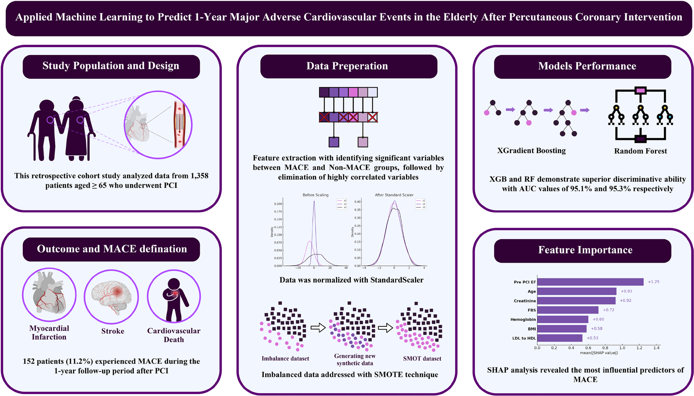
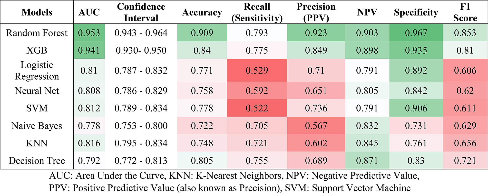
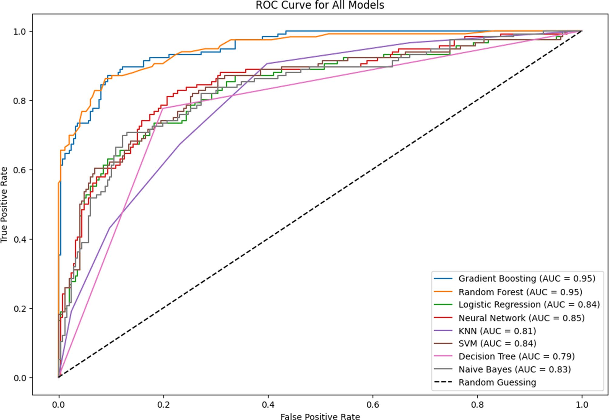
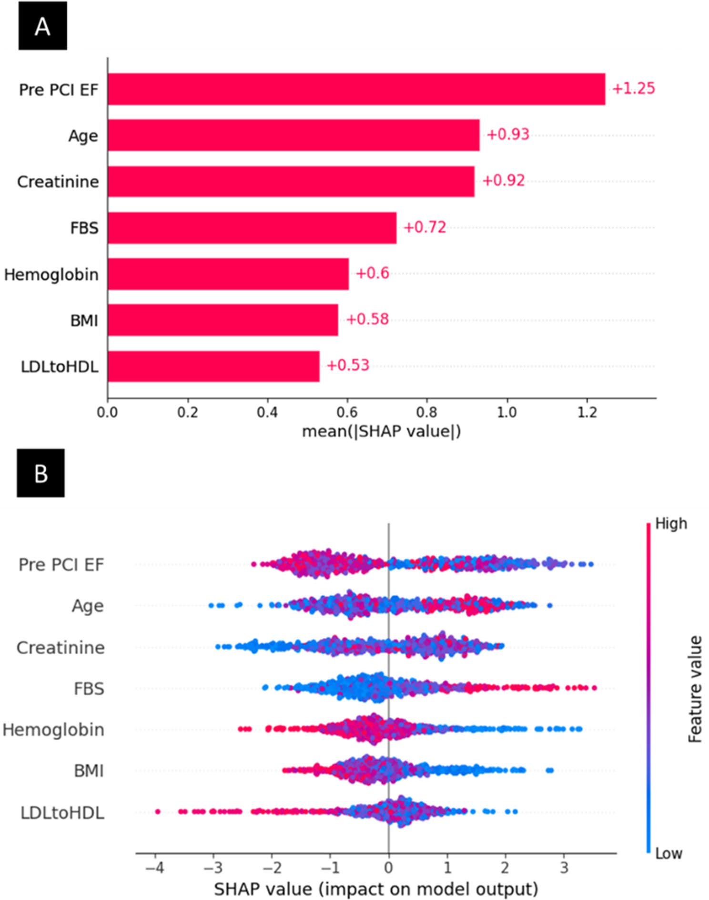

# One-year MACE prediction after PCI in elderly patients

[](https://doi.org/10.1186/s12911-025-03238-7)
[](https://www.python.org/)

Reproducible code, original analysis notebooks, and publication assets for:

> Jolfayi AG, Nasrollahizadeh A, Nasrollahizadeh A, et al. **Applied machine learning to predict 1-year major adverse cardiovascular events in elderly patients after percutaneous coronary intervention.** *BMC Medical Informatics and Decision Making*. 2025;25:401. [doi:10.1186/s12911-025-03238-7](https://doi.org/10.1186/s12911-025-03238-7)

The retrospective cohort included 1,358 patients aged 65 years or older who underwent PCI for STEMI. The endpoint was one-year MACE: cardiovascular death, myocardial infarction, stroke, or repeat revascularization. The article compares XGBoost, random forest, logistic regression, a neural network, SVM, naive Bayes, KNN, and a decision tree. In the published test results, random forest achieved AUC 0.953 (95% CI 0.943-0.964) and XGBoost achieved AUC 0.941 (95% CI 0.930-0.950).

> [!IMPORTANT]
> This repository is for research reproducibility, not clinical decision-making. The patient-level dataset is not public, so the included synthetic data can validate the software only; it cannot reproduce or validate the reported clinical performance.

## Reproducible workflow

The cleaned implementation in `src/pci_mace/` follows the article while preventing evaluation leakage:

1. Split the original cohort into stratified training and test sets.
2. Within the training pipeline, median-impute, standardize, and apply SMOTE.
3. Optionally tune hyperparameters with stratified cross-validation on the training set only.
4. Evaluate the final models once on the untouched test set.
5. Export metrics, bootstrap AUC confidence intervals, ROC and calibration curves, run metadata, and optional XGBoost SHAP plots.

This ordering is intentional. The historical notebooks are preserved under `notebooks/original/`, but some of them scale or apply SMOTE before splitting. Use the packaged pipeline for new analyses.

## Mathematical definitions

The equations below define the transformations and reported metrics used by the reproducible pipeline.

### Standardization

Each continuous predictor is standardized using statistics learned from the training fold only:

$$
z = \frac{x - \mu_{\mathrm{train}}}{\sigma_{\mathrm{train}}}
$$

Here, $x$ is the original value, while $\mu_{\mathrm{train}}$ and $\sigma_{\mathrm{train}}$ are the training-fold mean and standard deviation. Applying training statistics to validation and test observations prevents information leakage.

### Correlation analysis

Figure 2 uses correlation heatmaps to identify redundant predictors. For two continuous variables, Pearson correlation is:

$$
r_{xy} =
\frac{\sum_{i=1}^{n}(x_i-\bar{x})(y_i-\bar{y})}
{\sqrt{\sum_{i=1}^{n}(x_i-\bar{x})^2}
\sqrt{\sum_{i=1}^{n}(y_i-\bar{y})^2}}
$$

When a monotonic rank-based association is more appropriate and there are no tied ranks, Spearman correlation can be written as:

$$
\rho_s = 1-\frac{6\sum_{i=1}^{n}d_i^2}{n(n^2-1)}
$$

Here, $d_i$ is the difference between the paired ranks. Feature selection must be learned within training data; using the full dataset would leak information from the held-out test set.

### SMOTE class balancing

As described in Equation 1 of the article, a synthetic minority-class observation is generated between an observation and one of its minority-class nearest neighbors:

$$
x_{\mathrm{new}} = x_i + \lambda\left(x_i^{*} - x_i\right),
\qquad \lambda \sim U(0,1)
$$

Here, $x_i$ is a selected minority-class observation, $x_i^{*}$ is one of its $k$ nearest minority-class neighbors, and $\lambda$ determines the synthetic point's position between them. SMOTE is fitted only to training folds.

### Model probabilities

For logistic regression, the estimated probability of one-year MACE is:

$$
\hat p(y=1\mid x) = \sigma\left(\beta_0 + \sum_{j=1}^{p}\beta_j x_j\right),
\qquad
\sigma(a) = \frac{1}{1+e^{-a}}
$$

Random forest averages predictions from $T$ decision trees:

$$
\hat p_{\mathrm{RF}}(y=1\mid x) = \frac{1}{T}\sum_{t=1}^{T}\hat p_t(y=1\mid x)
$$

XGBoost forms an additive score from $M$ learned trees and converts that score to a probability:

$$
F_M(x) = \sum_{m=1}^{M}\eta f_m(x),
\qquad
\hat p_{\mathrm{XGB}}(y=1\mid x) = \sigma\left(F_M(x)\right)
$$

Here, $\eta$ is the learning rate and $f_m$ is the contribution from tree $m$.

For the linear support vector machine, the decision score is:

$$
g(x) = w^{\mathsf T}x+b,
\qquad
\hat y = \mathbb{1}\left[g(x)\geq 0\right]
$$

The implementation obtains an SVM probability using sigmoid calibration fitted within training data:

$$
\hat p_{\mathrm{SVM}}(y=1\mid x) =
\frac{1}{1+\exp\left(A g(x)+B\right)}
$$

The multilayer perceptron recursively computes hidden representations and a final sigmoid probability:

$$
h^{(\ell)} = g_{\ell}\left(W^{(\ell)}h^{(\ell-1)}+b^{(\ell)}\right),
\qquad
\hat p(y=1\mid x)=\sigma\left(W^{(L)}h^{(L-1)}+b^{(L)}\right)
$$

Gaussian naive Bayes applies Bayes' rule with conditionally independent features:

$$
P(y=c\mid x) \propto P(y=c)\prod_{j=1}^{p}P(x_j\mid y=c)
$$

For KNN, the class probability is the fraction of positive labels among the $k$ nearest observations $N_k(x)$:

$$
\hat p_{\mathrm{KNN}}(y=1\mid x) =
\frac{1}{k}\sum_{i\in N_k(x)}\mathbb{1}(y_i=1)
$$

A decision tree estimates probability from the class proportion in the terminal leaf $L(x)$ reached by an observation:

$$
\hat p_{\mathrm{DT}}(y=1\mid x) =
\frac{\sum_{i\in L(x)}\mathbb{1}(y_i=1)}{|L(x)|}
$$

### Classification metrics

Let $TP$, $TN$, $FP$, and $FN$ denote true positives, true negatives, false positives, and false negatives. The exported metrics are:

$$
\mathrm{Accuracy} = \frac{TP+TN}{TP+TN+FP+FN}
$$

$$
\mathrm{Sensitivity} = \mathrm{Recall} = \frac{TP}{TP+FN},
\qquad
\mathrm{Specificity} = \frac{TN}{TN+FP}
$$

$$
\mathrm{PPV} = \mathrm{Precision} = \frac{TP}{TP+FP},
\qquad
\mathrm{NPV} = \frac{TN}{TN+FN}
$$

Balanced accuracy gives sensitivity and specificity equal weight:

$$
\mathrm{Balanced\ Accuracy} = \frac{\mathrm{Sensitivity}+\mathrm{Specificity}}{2}
$$

As described in Equation 2 of the article, the F1 score is the harmonic mean of precision and recall:

$$
F_1 = 2\frac{\mathrm{Precision}\times\mathrm{Recall}}
{\mathrm{Precision}+\mathrm{Recall}}
$$

The positive and negative likelihood ratios summarize how much a prediction changes the odds of MACE:

$$
LR^{+} = \frac{\mathrm{Sensitivity}}{1-\mathrm{Specificity}},
\qquad
LR^{-} = \frac{1-\mathrm{Sensitivity}}{\mathrm{Specificity}}
$$

### ROC, AUC, and confidence intervals

The ROC curve plots the true-positive rate against the false-positive rate across classification thresholds $c$:

$$
\mathrm{TPR}(c) = \frac{TP(c)}{TP(c)+FN(c)},
\qquad
\mathrm{FPR}(c) = \frac{FP(c)}{FP(c)+TN(c)}
$$

The area under that curve summarizes discrimination:

$$
\mathrm{AUC} = \int_{0}^{1}\mathrm{TPR}(u)\,du
$$

The pipeline estimates the 95% AUC confidence interval by resampling the untouched test set with replacement. If $\mathrm{AUC}^{*(1)},\ldots,\mathrm{AUC}^{*(B)}$ are the bootstrap estimates, then:

$$
\mathrm{CI}_{95\%} =
\left[Q_{0.025}\left(\mathrm{AUC}^{*}\right),
Q_{0.975}\left(\mathrm{AUC}^{*}\right)\right]
$$

Discrimination does not guarantee calibrated probabilities. The pipeline therefore also exports the Brier score:

$$
\mathrm{Brier} = \frac{1}{n}\sum_{i=1}^{n}(\hat p_i-y_i)^2
$$

Lower Brier scores indicate smaller squared probability error. Calibration plots compare mean predicted risk with the observed event fraction in each probability bin.

### SHAP explanations

For an individual prediction, SHAP decomposes the model output into a baseline and feature contributions:

$$
f(x) = \phi_0 + \sum_{j=1}^{p}\phi_j
$$

Here, $\phi_0$ is the expected model output and $\phi_j$ is feature $j$'s contribution. Global importance in the exported bar plot is the mean absolute contribution:

$$
I_j = \frac{1}{n}\sum_{i=1}^{n}\left|\phi_j^{(i)}\right|
$$

## Installation

```bash
git clone https://github.com/AmirGhaffari96/PCI_outcome_predict.git
cd PCI_outcome_predict
python -m venv .venv
source .venv/bin/activate
python -m pip install --upgrade pip
python -m pip install -e '.[dev]'
```

### Smoke test with synthetic data

```bash
python scripts/generate_demo_data.py --rows 600 --output data/demo.csv
pci-mace train \
  --data data/demo.csv \
  --output outputs/demo \
  --models xgboost random_forest logistic_regression decision_tree \
  --bootstrap 100
pytest
```

Synthetic results must not be compared with the article's clinical results.

### Run on authorized study data

The expected columns are documented in [`data/README.md`](data/README.md). To run all eight models with training-fold grid search and SHAP explanations:

```bash
pci-mace train \
  --data data/Data.xlsx \
  --output outputs/paper-run \
  --models all \
  --tune \
  --shap
```

The command writes:

- `metrics.csv` - AUC, 95% bootstrap CI, accuracy, balanced accuracy, sensitivity, specificity, PPV, NPV, F1, Brier score, and likelihood ratios.
- `roc-curves.png` - test-set ROC comparison.
- `calibration-curves.png` - observed versus predicted risk and each model's Brier score.
- `run-metadata.json` - features, split settings, seed, SMOTE ratio, and best hyperparameters.
- `shap-feature-importance.png` and `shap-summary.png` - generated when `--shap` is requested.

## Repository layout

```text
.
├── src/pci_mace/           # Leakage-resistant reusable pipeline and CLI
├── scripts/                # Synthetic-data generator
├── tests/                  # Automated smoke tests
├── data/README.md          # Data-access note and required schema
├── notebooks/original/     # Author-provided historical notebooks
├── paper/                  # Published PDF and unmodified figures
├── TECHNICAL_NOTES.md      # Reproducibility audit and manuscript issues
├── CITATION.cff            # Machine-readable citation
└── THIRD_PARTY_NOTICES.md  # Article/figure license notice
```

The older root-level scripts and notebooks remain available for provenance and comparison.

## Technical issues and reproducibility notes

The supplied historical notebooks and manuscript were audited separately from the clean implementation. Important findings include preprocessing leakage, a feature-selection dataframe that is not used for modeling, non-stratified splits, inconsistent feature typing, missing notebook evidence for the reported grid search and AUC confidence intervals, and conflicting AUC/SHAP statements in the manuscript.

See [`TECHNICAL_NOTES.md`](TECHNICAL_NOTES.md) for evidence, likely impact, severity, and the repository's mitigation for each issue. These notes do not change the published article; they make the limits of reproduction explicit.

## Article figures

All images below are unmodified extractions from the published article PDF.

### Graphical abstract



**Technical reading:** The artwork reports XGBoost AUC 95.1% and random forest AUC 95.3%. Table 2 and its surrounding results text report 94.1% and 95.3%, respectively; the XGBoost value should be verified against the locked analysis output.

### Figure 1 - Summary of methods and results


**Technical reading:** Figure 1 repeats the graphical-abstract artwork in the numbered figure sequence, as published. Its reported XGBoost AUC has the same 95.1% versus 94.1% discrepancy noted above.

### Figure 2 - Correlation heatmaps and feature selection



**Technical reading:** Heatmap cells represent pairwise correlation coefficients such as $r_{xy}$ defined in [Correlation analysis](#correlation-analysis). Predictor selection should be performed within each training fold to avoid selection leakage.

### Figure 3 - ROC curves for all models



**Technical reading:** The legend labels the leading boosted model as "Gradient Boosting," whereas the methods and Table 2 call it XGB/XGBoost. The plotted AUC is rounded to 0.95; Table 2 reports XGBoost AUC 0.941. ROC definitions are provided in [ROC, AUC, and confidence intervals](#roc-auc-and-confidence-intervals).

### Figure 4 - XGBoost SHAP interpretation



**Technical reading:** The direction narrative requires author verification. The results text describes lower pre-PCI EF and age as higher risk while calling those values red, but the figure legend defines red as high. The caption then states that high pre-PCI EF and age increase risk. These statements are internally inconsistent, and the univariate table separately shows lower EF but higher age in the MACE group. SHAP definitions are provided in [SHAP explanations](#shap-explanations).

## Data availability and privacy

The article states that the supporting data are available from the corresponding author upon reasonable request. No patient-level data are committed here. The `.gitignore` excludes CSV and Excel files under `data/` to reduce the risk of accidentally publishing protected clinical information.

## Citation and article license

Citation metadata are available in [`CITATION.cff`](CITATION.cff). The article PDF and its figures are distributed under [CC BY-NC-ND 4.0](https://creativecommons.org/licenses/by-nc-nd/4.0/); see [`THIRD_PARTY_NOTICES.md`](THIRD_PARTY_NOTICES.md). They are included unmodified with attribution. The article license does not automatically license the source code.
